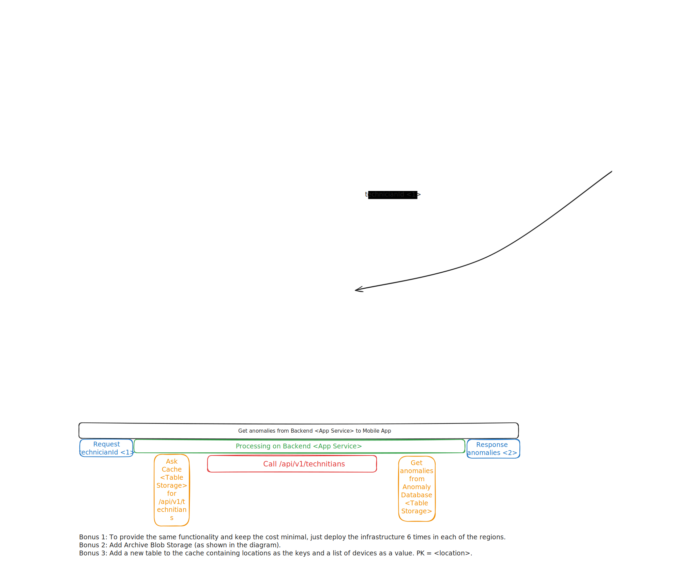

# Datamole IoT solution

The task is available at [this URL](https://github.com/datamole-ai/mff-cloud-app-development/blob/02f1c777148998c748c38da9e542e45695b3d563/semestral-project-assignment.md]).

This solution contains an Azure architecture for a system that tracks and observes anomalities in logs that are collected by various devices. Technicians then have access to the anomalities and may resolve them accordingly.

